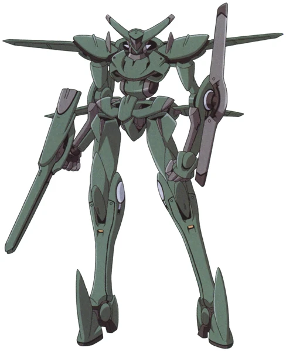
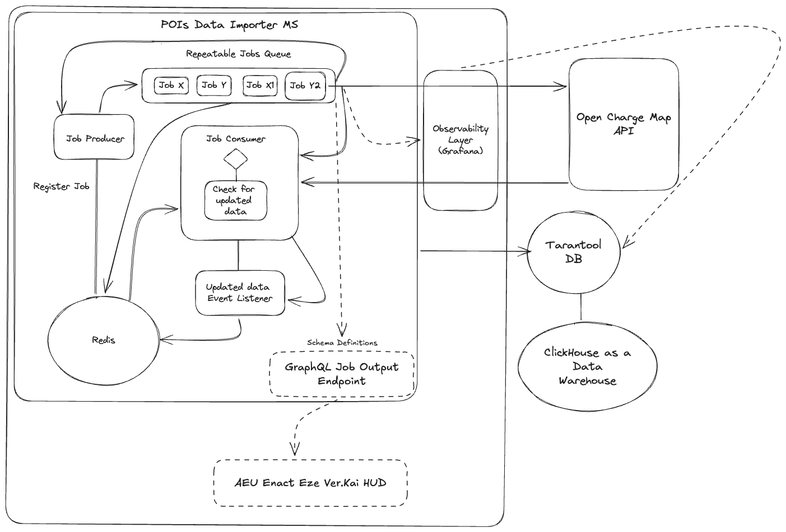
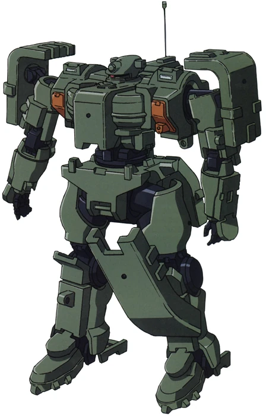

# Project Overview: AEU Enact & Open Charge Map Integration

## Summary
I decided to use an army of Mechas of the fictional series **Mobile Suit Gundam 00**, this machine is developed by the **AEU (Advanced Eurpean Union)**, this is because electric vehicles are boring.

The **AEU Enact Eze** project aims to modernize the logistical support for the AEU Enact mobile suit series (specifically the *AEU-09 Enact* and its variants) by integrating them with the **Open Charge Map (OCM)** ecosystem. While the Enact primarily relies on solar energy generation via its orbital ring system, ground-based operations and extended combat deployments often require rapid auxiliary power replenishment. This project creates a digital bridge allowing Enact pilots to locate, reserve, and navigate to compatible high-voltage charging stations.



## Objectives
*   **Real-time Station Discovery:** Enable the Enact's onboard computer to query OCM for charging stations within a tactical radius.
*   **Compatibility Filtering:** Filter OCM results for stations capable of delivering the high voltage/amperage required by mobile suit capacitors (e.g., filtering for >350kW CCS or fictional "Orbital-Grade" connectors).
*   **Route Optimization:** Integrate charging stops into the Enact's tactical navigation overlay.
*   **Secure Communication:** Ensure location data of the mobile suit remains encrypted during API queries.

## System Architecture

The solution utilizes a **NestJS** backend acting as a "Tactical Support Middleware" between the Mobile Suit and the public internet.



The Microservice will use BullMQ to create a Job Producer that will spawn enqueuable Repeatable Jobs to fetch data from the OCM API using the proper GraphQL schema to retrieve just the necessary data. BullMQ enforces the use of Redis to keep track of the state of each job.

There will be also an event listener layer coded in Lua in top of Redis to report the state (success or failure) of each job.

For observability we will use Prometheus and Grafana to monitor the performance and the state of the service. This will be connected directly to the event listener.

## Database

To avoid repeating database schemas that match the GraphQL ones and following the DRY principle I decided to use [Tarantool](https://www.tarantool.io/en/tarantooldb/doc/latest/) as the database. Tarantool is a russian DB that uses Lua tables to store data.

```lua
#!/usr/bin/env tarantool

-- Configure the Tarantool instance
box.cfg{
    listen = 3301,
    memtx_memory = 128 * 1024 * 1024, -- 128MB memory limit
}

-- Initialize the schema once
box.once('init_schema', function()
    -- Create a space named 'stations' to store OCM data
    local stations = box.schema.space.create('stations', {
        if_not_exists = true,
        format = {
            {name = 'id', type = 'unsigned'},           -- OCM ID
            {name = 'uuid', type = 'string'},           -- OCM UUID
            {name = 'title', type = 'string'},          -- Station Title
            {name = 'latitude', type = 'number'},       -- GPS Lat
            {name = 'longitude', type = 'number'},      -- GPS Lon
            {name = 'max_power_kw', type = 'number', is_nullable = true}, -- Calculated max output
            {name = 'raw_data', type = 'map'}           -- Full JSON object from OCM
        }
    })

    -- Create a primary index on the OCM ID
    stations:create_index('primary', {
        parts = {'id'},
        if_not_exists = true
    })

    -- Create a secondary index on UUID
    stations:create_index('uuid', {
        parts = {'uuid'},
        unique = true,
        if_not_exists = true
    })

    print('AEU Enact Eze: Station schema initialized.')
end)

-- Stored procedure to upsert (update or insert) station data
function save_station_data(data)
    local id = data.ID
    local uuid = data.UUID
    local address = data.AddressInfo or {}
    local title = address.Title or 'Unknown Location'
    local lat = address.Latitude or 0
    local lon = address.Longitude or 0
    
    -- Calculate max power for the Mobile Suit capacitors
    local max_kw = 0
    if data.Connections then
        for _, conn in pairs(data.Connections) do
            if conn.PowerKW and conn.PowerKW > max_kw then
                max_kw = conn.PowerKW
            end
        end
    end

    -- Perform the upsert
    box.space.stations:upsert(
        {id, uuid, title, lat, lon, max_kw, data},
        {
            {'=', 3, title},
            {'=', 4, lat},
            {'=', 5, lon},
            {'=', 6, max_kw},
            {'=', 7, data}
        }
    )
    return true
end
```

Lua tables are state-of-the-art associative arrays. Where keys and values can be everything (functions, strings, numbers, and other tables). The language even provides metatables to create macros to modify on-the-fly the table behavior.

The main line of thought is that in this fictional world of Gundam 00 where giant transformable electric-powered mobile suits need to be deployed startegically across Europe, the use of SQL databases seems cumbersome. The pilot should be able to use the data as code (one of the LISP principles for symbolic compuitattion). A dynamic typed language will perfectly fit a MS pilot.

## How to Run

### Prerequisites
*   Docker
*   Docker Compose

### Environment Setup
Create a `.env` file in the root directory with your Open Charge Map API key:

```bash
PORT=3000
OCM_API_KEY=your_open_charge_map_api_key
TARANTOOL_HOST=tarantool
TARANTOOL_PORT=3301
REDIS_HOST=redis
REDIS_PORT=6379
```

### 2. Start the Stack
Run the following command to build and start all services:

```bash
docker-compose up --build
```

### Access Points
*   **AEU Enact Eze API (GraphQL):** http://localhost:3000/graphql
*   **Prometheus (Metrics):** http://localhost:9090
*   **Grafana (Dashboards):** http://localhost:3001 (Default login: `admin` / `admin`)

### Usage
1.  Open the GraphQL Playground at `http://localhost:3000/graphql`.
2.  Run the `spawnFetchJob` mutation to start fetching data for a specific sector:
    ```graphql
    mutation {
      spawnFetchJob(latitude: 52.5200, longitude: 13.4050, distance: 50)
    }
    ```

## Testing

### End-to-End (E2E) Tests
To run the end-to-end tests (which mock external services like OCM and Tarantool):
```bash
npm run test:e2e
```


# Issues
Couldn't make the Dockerization work because of the Tarantool Database. Somehow enters into an infinite loop and now I have no energy not the will to fix it. Hecking russians (love them) hahahaha. In Gundam 00 they are not part of the AEU, they are from the Human Reform League (Russia, India and China) and their mobile suits use fossil fuels.

Here's their Tieren:



### Tieren Specs (MSJ-06II-A)
*   **Unit Type:** Mass Production Ground Mobile Suit
*   **Manufacturer:** Human Reform League (HRL)
*   **Height:** 18.1 meters
*   **Weight:** 121.3 metric tons
*   **Power Source:** Fossil Fuel Engine
*   **Armor:** E-Carbon
*   **Armament:**
    *   200mm x 25 Caliber Smoothbore Gun
    *   30mm Machine Gun
    *   Carbon Blade
    *   Shield

# Final Considerations

I made this project as a work of fiction. I'm right now recovering from a major cirurgy and I'm feeling a lot of pain. So I decided to have fun with this challenge.
